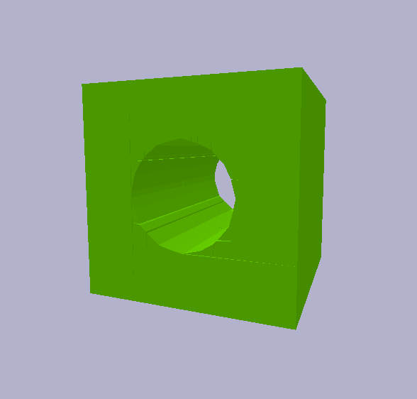
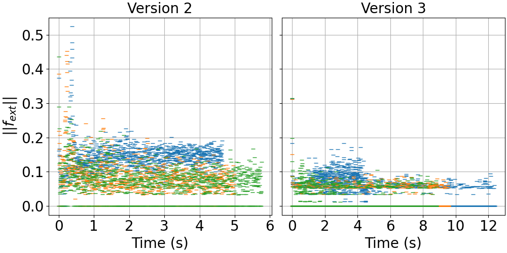
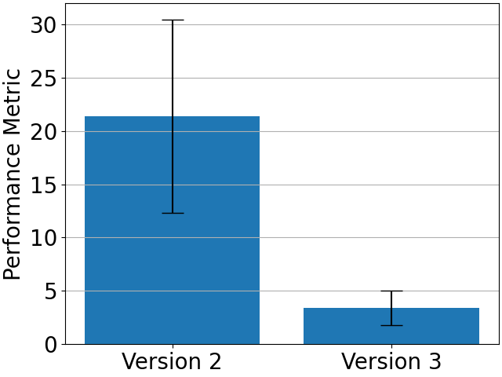
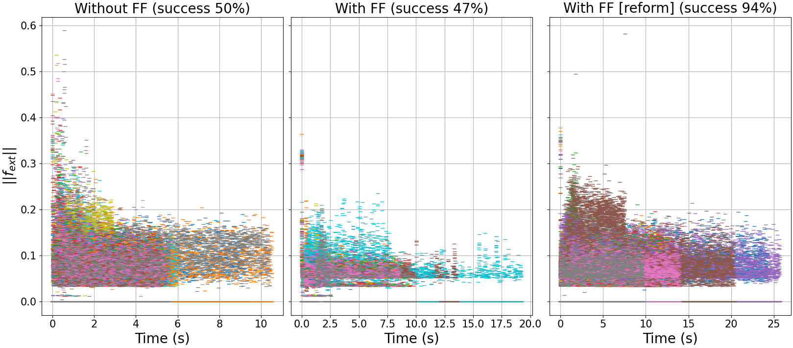
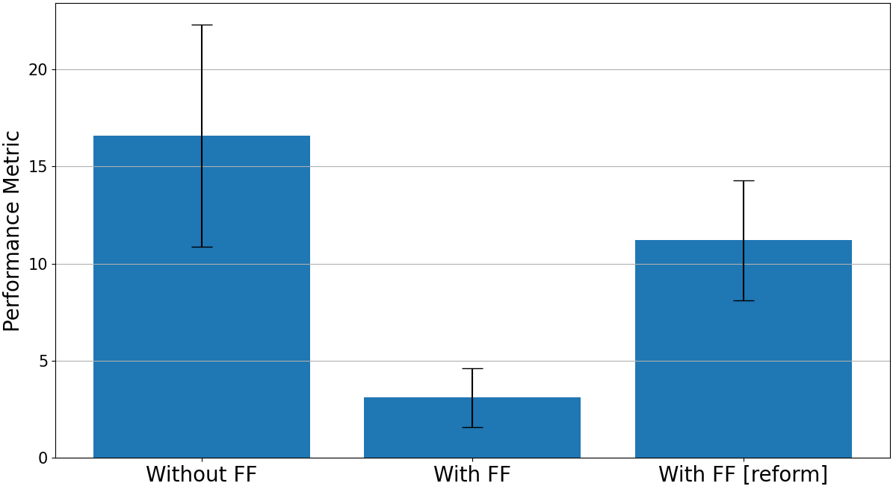
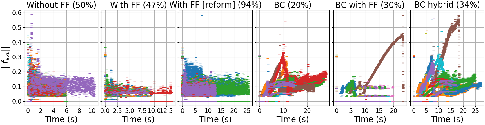
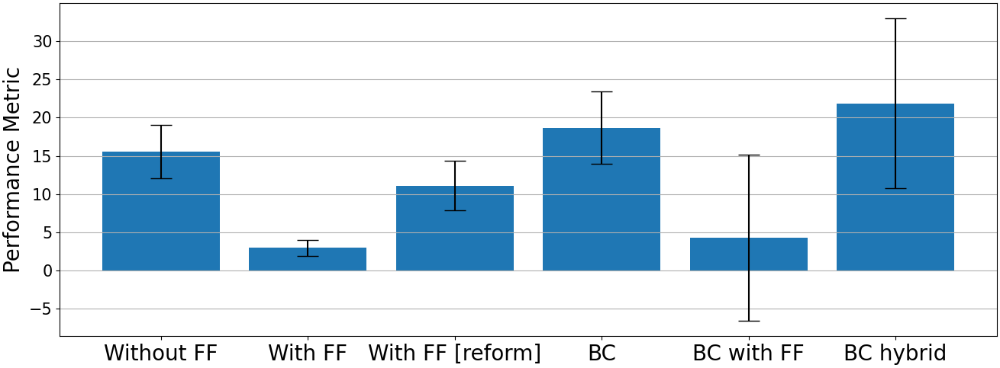

# Autonomous Trocar Docking

This repo started as an investigation for working out how to solve the peg-in-hole task for a non-static hole.
Now, I have made it the main repo for investigating work on autonomous trocar docking (just to explain why `peg_in_hole` is referenced so much).

# Requirements

* [OpTaS](https://github.com/cmower/optas)
* [PyBullet](https://pybullet.org/)
* [Numpy](https://numpy.org/)
* [Scipy](https://scipy.org/)

# Object with hole

	

The object with a hole used in this package (i.e. `cube_hole_vhacd.obj`) was a headache to get working in PyBullet.
Working meaning:
(i) a cube that can move in all 6 axes (3 position + 3 rotation), and
(ii) other objects (e.g. cylinders) can fit through the hole in the center of the cube.

Resources that helped resolve the issue:

* [bulletphysics/bullet3 issue 2531](https://github.com/bulletphysics/bullet3/issues/2531)
* [V-HACD](https://github.com/kmammou/v-hacd)

# `plan_peg_in_hole_fixed.py`

The `plan_peg_in_hole_fixed.py` script shows an implementation of a solution for the basic peg in hole problem.
This example assumes the hole is in a known fixed/static location.
A planner is implemented and used to find/execute a trajectory to a pre-insertion pose, and then re-used to plan/execute the insertion.

The goal of this example is to show that when you assume perfect knowledge of the environment, a simple planner can be used to solve the problem.

# `plan_peg_in_hole_unfixed_v1.py`

This script uses similar assumptions as previous script (i.e. snapshot of the box pose, and access to a basic planner).
However, in this case, the box with the hole responds to interaction and moves.
Also, the snapshot of the box pose contains noise (~0.5cm, default) to simulate reality.

The goal of this example is to show that the planner developed for the previous situation is insufficient to solve the problem where the box moves and sensor noise exists.

# `plan_peg_in_hole_unfixed_v2.py`

This script uses the same assumption as the previous script.
We assume access to the box pose over time under the same noise model as in the previous script.
In a real world setup, the pose could be extracted using markers like AprilTags.
However, the goal is to develop an approach that utilizes measured interaction (i.e. through torque sensing) and potentially some state-estimation (for the box) using vision (i.e. markerless).

The goal here is to show that, under the same assumptions as the previous script, and also assuming access to the box pose (even a noisy measurement) we can solve the problem with a nonlinear feedback controller.

Some notes:

* Whilst this approach solves the problem, a disadvantage is that is possible that it can exert large interaction forces on the trocar (bad!).
* Using the feedback controller allows the robot to complete the task for higher range of noise.

# `force_sensing.py`

This script was used to investigate force sensing simulation.
The robot is initially moved to an starting configuration.
After a controller tries to move the robot with an end-effector velocity of `[-0.02, 0., 0.]`.
A box is placed in the way of the robot that the end-effector will collide with during the motion.
Whent the end-effector inevitably collides with the box, the linear interaction force is sensed and used to update the goal end-effector goal.

The goal of this script is to show that force sensing is possible, and can be incorporated into a controller to minimize interaction forces.

# `plan_peg_in_hole_unfixed_v3.py`

This script uses the same assumptions as the version 2 script (i.e. `plan_peg_in_hole_unfixed_v2.py`).
However, here we assume access to the force interaction data between the end-effector and the the box.
The force interaction is estimated by mapping the estimated external torques to the end-effector space using the inverse of the manipulator Jacobian.
That is

$$f_{ext} = J(q_c)^{-T} \tau_{ext}$$

where
* $f_{ext}$ is the external interaction force experienced at the end-effector
* $J(\cdot)$ is the manipulator jacobian array
* $q_c$ is the current robot configuration, and
* $\tau_{ext}$ is the external torques

An issue with version 2 is that it does not handle interaction forces between the robot and box, and consequently it is possible that large forces may get applied to the box.
In a real setting where the box is a trocar, this would be dangerous.
The goal of this script is to investigate how to incporate force sensing and reduce the interaction forces with the trocar.

Some notes:

* Whilst this script demonstrates that interaction sensing can be successfully incorporated into a controller to solver the problem, it was quite a hassle deriving the correct models for the problem (i.e. cost terms), and the respective weightings were very difficult to tune.
* This makes me think that learning parts of the model, or the respective weightings might be of interest [1].

# Experiment: approach in version 3 reduces interaction forces between robot and box

The interaction data, i.e. $f_{ext}(t)$ over the duration of the insertion, was collected for several runs for each version (i.e. scripts `plan_peg_in_hole_unfixed_v2.py` and `plan_peg_in_hole_unfixed_v3.py`).
The goal is to show that the interaction forces are reduced by incorporating the sensing data into the controller.

Figure 1, below, shows the distribution of $\|f_{ext}(t)\|$ over time for several runs of each method.
Two things are noteworthy
* Visually, it is apparent that the interaction forces are reduced using version 3.
* Version 3 takes longer to complete than version 2.

	

	<b>Fig 1:</b>
	Distribution of $\|f_{ext}\|$.

The above plot visually demonstrates that there is a reducion in the interaction forces with the box.
This is quantified using the following formula.

$$M = \frac{1}{T}\int_0^T\|\|f_{ext}(t)\|\|~dt$$

where
* $M$ is the performance metric evaluated for each trial, and
* $T$ is the total time taken for a trial,

The performance metric above is used to compare each dataset.
Lower values indicate higher performance, i.e. generally lower interaction forces is desired.
Note, the formula is normalized in time to ensure a fair comparison.

	

	<b>Fig 2:</b>
	Comparison of version 2 and 3 for the performance metric defined above.

Clearly, version 3 is superior to version 2.
The plots indicate that version 3 generally induces lower interaction forces between the robot and box.

Some notes:
* The plots above are based on three successful trials for each approach.
* Each approach does not always succeed. This can be due to several reasons.
  * Version 2
	* Since interaction does not play a role, the robot may get struck pushing against the side of the box and continue to push.
	* Sometimes the robot clips the side of the box, the box freaks out, and since the robot is linked via the state estimation, the robot also freaks out.
  * Version 3
	* Sometimes the interaction forces counteract progress. So the robot can get struck between minimizing interaction and making progress into or torwards the hole.
	* Sometimes the initial configuration is not ideal, and the robot does something weird. I have a suspicion this is linked to the use of the manipulability measure in the planner used to move the robot to the initial configuration (which is not always the same for each trial).

# `plan_peg_in_hole_unfixed_v4.py`

The script uses the same assumptions as version 3.
However, here I have reformulated the cost function, effectively simplifying the model.
See [here](https://docs.google.com/presentation/d/14SnXDx1kxslInMgz2G7qHOGlxGqN3X0I17yxS4QV2cI/edit#slide=id.g1dc1e9e42ce_0_0) for a summary of the cost terms.

The goal of this script was to look into a better formulation for the task.
It seems (see following experiment section) this was found!

# Experiment: the approach in ver4 is much more successful, with a small caveat

I extended the previous experiments to compare version 4.
Ultimately the same experiemnt was performed with the new controller.
As well as comparing the force interactions, I also compare the success rate.
In this experiment, I ran 50 trials for each versions 2, 3, and 4.
The figures showing the results are plotted below.
Note the graph titles were changed (because I updated this for the Hamlyn paper submission).
Ver 2, 3, 4 is "without FF", "with FF", and "with FF [reform]" respectively.

	

	<b>Fig 1:</b>
	Distribution of $\|f_{ext}\|$.

	

	<b>Fig 2:</b>
	Comparison of version 2, 3, and 4 for the performance metric defined above.

In addition to these results, I recorded the durations for each trial.
These results are summarized in the following table.

|                        | Average duration (secs) | Max duration (secs) |
|------------------------|-------------------------|---------------------|
| Ver2 (without FF)      | 5.9 +/- 1.6             | 10.5                |
| Ver3 (with FF)         | 9.8 +/- 2.2             | 19.2                |
| Ver4 (with FF, reform) | 14.3 +/- 4.9            | 26.8                |

Conclusions
* **Success rate**: version 4 is much more successful at completing the task.
* **Forces applied to trocar**: version 4 generally has more interaction with the trocar, i.e. higher values for $M$ (small caveat). However, generally the range of interaction forces is low (seen visually in the distribution).
* **Completion time**: ver 4 takes longer, on average the increase is not too significant. However, the maximum duration was quite high.

# Hyperparameter Optimization

I have an interest to investigate tuning the weights for the cost terms.
This is a nice problem to investigate this and fairly easy to adapt the implementation.

Prior to version 4 being developed, I expected to put a lot of time into this - however, since this latest approach seems fairly successful (with little effort towards hyperparameter tuning), see previous section, this investigation is not needed.
It is just intersting for me to explore, since this is something I have thought about before - i.e. how to optimally tune weights on the cost terms (my current approach is ultimately trial-and-error).
However, this is now not so important, so I will put it on a back burner.

## Problem Formulation

The goal is to find optimal values for the hyperparameters of the controller.
In this case it is the weights on the cost terms, let these be denoted $w\in\mathbb{R}^N$ where $N$ is the number of cost terms incorporated in the controller cost function.

The goal is to solve the problem

$$
w^* = \underset{w}{\text{arg}\max}~f(w)
$$

where $f: \mathbb{R}^N\rightarrow\mathbb{R}$ is a function that takes as input the parameters and outputs a scalar value that scores how well the controller performed.
As an initial guess, the function $f$ was defined as

$$
f(w) =
\begin{cases}
  -t - 20M \quad \text{if controller succeeded}\\
  -1000 \quad \text{if controller failed}
\end{cases}
$$

Note
* $f$ is ultimately a reward function.
* that in order to evaluate $f$, the whole simulation is required to be executed.
* Multiplying $M$ by 20 in the above formulation for $f$ is fairly arbitrary. I took a look at the data for the values of $M$, and thought that they should be roughly in the same scale as $t$. There is no other reasoning for this choice.
* Also, the choice for -1000 is arbitrary.

## Approaches

Several common approaches for hyper parameter optimization are listed on [wikipedia](https://en.wikipedia.org/wiki/Hyperparameter_optimization).
I am going to investigate
* Grid search, see `plan_peg_in_hole_unfixed_gridsearch.py`
* Random search, see `plan_peg_in_hole_unfixed_random.py`
* Bayesian optimization, see `plan_peg_in_hole_unfixed_bayesopt.py`
* Evolutionary optimization, see `plan_peg_in_hole_unfixed_evolution.py`

I missed out gradient-based optimization since the function $f$ is non-differentiable, and I expect finite differences will be much to expensive.
Some other methods were also missed out that are listed in wikipedia; this is because there is no code for these methods that I could find and easily implement.

## Results

**TODO**
I will summarize the results for these and notes, but I need a cluster to run all this on.
Probably this will take some days to complete.

# Learning how to complete the task via imitation learning

Learning how to perform the task may be an interesting avenue.
It may be the case that the task is too complex in reality, and the force sensing too noisy for an optimization-based apparoach for optimal control.
Furthermore, a potential hybrid approach (i.e. model-based + learning) could be interesting to investigate and potentially have some novelty.

## DMP

Dynamic Motion Primitives (DMPs) are a very common approach used in imitation learning.
A DMP is a dynamical system model that can be used to learn complex motions.
The model is reletively simple, and (under certain assumptions) has an analytical solution for the model parameters given a demonstration.
The literature on DMPs is extensive!
A nice overview of the basics is [here](https://studywolf.wordpress.com/2013/11/16/dynamic-movement-primitives-part-1-the-basics/).

First I considered that the most ideal method (and easiest first step) would be to use a DMP [2].
There is a nice library for DMPs [here](https://github.com/dfki-ric/movement_primitives) (keep this in mind for future).
However, I realized that in our case the goal moves (at training and execution time), thus training is not going to work.
There is work that attempts to address this issue [3] (i.e. moving goal) but (i) there is no code (that I have found), and (ii) their work assumes the system is trained in the traditional way (i.e stationary goal for the demonstration).
Assumption in (ii) means this approach is difficult to apply here.
This is because I would need to fix the trocar in a known location for the demonstration.
I may be able to uncover the task with their method (and have it adapt to the non-static trocar/goal), however their approach does not incorporate interaction forces.
Therefore it will not regulate the robot motion to high interaction forces.
An extension for the DMP formulation may however be interesting, and I think this would be a strong theoretical contribution.

### Potential investigation

* How to adapt the DMP formulation in [3] to handle training on moving targets?
* How to incorporate forces from sensing into the formulation? This particular point, on its own, I don't believe is novel (see [4]), but handling non-static goals in the training data and incorporating sensed forces into the execution may be novel.

This seems to be a nice theoretical investigation, and from the quick scan of the literature I think it's possible this could be novel.
However, alternative approaches using behaviour cloning (e.g. see following sections) may handle this issue.
Another paper that I came across that would be worth looking at is [5].

## Behaviour cloning

The DMP idea may take some time to develop.
In the meantime, I think its reasonable to try and just learn a control policy via behaviour cloning (same approach as I used for the [NSL demo](https://youtu.be/1sswYtsS7Uc)).
This is also a good opportunity to implement something in PyTorch.

### Attempt Approach 1

The mapping I am trying to learn is given by

$$
	action = F_\theta(state)
$$

where
* $state = (q, p, r)$ is the state vector
* $action = (\dot{q})$ is the action vector
* $F$ is the model, i.e. neural network
* $\theta$ are the model parameters, i.e. neural network weights
* $q\in\mathbb{R}^n$ is the current joint configuration for an $n$-dof robot, $n=7$ in our case
* $p\in\mathbb{R}^3$ is the position of the trocar
* $r\in\mathbb{R}^4$ is the rotation (quaternion) of the trocar
* $\dot{q}\in\mathbb{R}^n$ is the joint velocity

See `plan_peg_in_hole_unfixed_nn.py` for the implementation of this model in the simulation.
The goal here is to investigate if the task can be learned from demonstrations.
However, notice that the force feedback term is not included in the $state$.
An additional goal in this case, is to see if we can learn the task from state information, then use a hybrid approach to incoporate the sensed forces.
In reality, when using kinesthetic teaching, the force feedback measurements $f_{ext}$ won't be available (since they are corrupted by the human interaction).
Furthermore, it may be interesting to learn the task in simulation and use the learned policy on the real robot (i.e. sim2real) - in this case, it would be unwise to incorporate the force feedback $f_{ext}$ in the state information since the dynamic parameters in the URDF and simulator object for the trocar surely do not match reality.
If the hybrid controller works, then this may be some validation that (with some tuning) we could use the learned policy in a hybrid implementation on the real system.

Notes
* After some consideration, I think it may be a mistake to train a policy on the joint states $q$. This is because the robot has a lot of redundancy that the network must learn - meaning more training data is required. A possible way to get round this is to instead of the joint configuration $q$ and velocity $\dot{q}$ use the end-effector position $e(q)$ and approach axis $\widehat{z}(q)$.

### Attempt Extended Approach 1 (hybrid)

Since the approach in the previous section does not incorporate forces, it would be interesting to explore a hybrid learning/model-based approach.
This is a first attempt at an extended hybrid approach.
See the script `plan_peg_in_hole_unfixed_nn_hybrid.py` for the implementation of the controller.
The controller is formulated as a constrained nonlinear optimization program, as follows

$$
\dot{q}^* = \underset{\dot{q}\in\mathbb{Q}}{\text{arg}\min}~\|\|\dot{q} - F_\theta(state)\|\|^2 + \lambda\|\|\psi(q_c + \delta t\dot{q}) - r(\tau_{ext}, q_c)\|\|^2
$$

where
* $q, \dot{q}\in\mathbb{R}^n$ is the joint position/velocity for an $n$-dof robot
* $\mathbb{Q}$ is the space of feasible states (representing the constraints)
* $F_\theta$ is the mapping learned in the previous approach
* $\lambda\in\mathbb{R}$ is a scalar weight
* $\delta t$ is the time step
* $r$ is a goal position that represents an appropriate response to the interaction forces

Note, the above formulation is not precisely the formulation as in the implementation - but basically it's the same.

### Attempt Approach 2

Another approach to investigate is whether the task can be learned that incorporates force feedback (as opposed to what I said in the previous section).
In reality, data could be collected via teleoperation (so we can incorporate interaction forces).
However, I fully expect teleoperation to be very difficult for collecting data.
Also, it raises questions on the interface; since the task involves contact with the environment, without force feedback the human may not give quality demonstrations.
Either way, it will be interesting to compare this approach to alternatives.

In this case we learn the mapping given by

$$
	action = F_\theta(state)
$$

where
* $state = (q, p, r, f_{ext})$ is the state vector
* $action = (\dot{q})$ is the action vector
* $F$ is the model, i.e. neural network
* $\theta$ are the model parameters, i.e. neural network weights
* $q\in\mathbb{R}^n$ is the current joint configuration for an $n$-dof robot, $n=7$ in our case
* $p\in\mathbb{R}^3$ is the position of the trocar
* $r\in\mathbb{R}^4$ is the rotation (quaternion) of the trocar
* $f_{ext} = J^T\tau_{ext}\in\mathbb{R}^6$ is the external force measured from the joint torques $\tau_{ext}\in\mathbb{R}^n$
* $\dot{q}\in\mathbb{R}^n$ is the joint velocity

Notice the state includes the force feedback term $f_{ext}$.
It will be interesting to see to what extent the performance is improved by incorporating $f_{ext}$.

### Data collection

A number of demonstrations is collected by running version 4, and saving the data.
We collect $N$ demonstrations, discarding failed demonstrations; data is collected until $N$ successful demonstrations are collected.
See `data_collection.py`.

Data collected:
* 500 successful demonstrations.
* The total number of training points is 1,597,602.

### Training

The neural network structure and training is implemented in the following scripts.
* `behaviour_cloning.py` implements approach 1
* `behaviour_cloning_2.py` implements approach 2
As a start, I just use a standard fully connected model.

### Experiment: we can learn the task using BC (but not very successfully)

I ran similar experiments to the previous sections, now using the BC approaches. The results are shown below.
Note
* "Without FF" is ver2
* "With FF" is ver3
* "With FF [reform]" is ver4
* "BC" is using BC approach 1
* "BC with FF" is using approach 2
* "BC hybrid" is the hybrid approach

	

	<b>Fig 1:</b>
	Distribution of $\|f_{ext}\|$.

	

	<b>Fig 2:</b>
	Comparison of version 2, 3,4 and BC approaches for the performance metric defined above.

Notes
* These results show that the task can be learned, but with low success rate. I definitely noticed the approach got better with more training data. So I am fairly confident that switching to the task space will be worthwhile.
* The BC with FF method reduces the interaction forces on successful attempts.
* The success rate is slightly higher for when using the hybrid approach, but the force interaction is generally higher. Tuning the response gains may help, perhaps interesting to investigate. However, right now I think the best next step is to re-implement the BC code so that the policy is learned in the task space - rather than the redundant joint space.

## Supplementation of Branch: Hybrid position-force control
Conventional position-force control aims at addressing manipulation of fixed-structure plants. As the sensor can acurately get trocar's position and orientation. The error will be ultimately elimited if running time lasts long enough.

### Version 1 (with suffix of hy_v1)
This script is an inplemenation of HPFC in docking. In this scenario, we added a constant virtual force (velocity).
The selection of virtual force is a trade-off between time efficiency and safety(Force amplitude). Here we choosed an empirical value 0.05.

### Version 2 (with suffix of hy_v2)
I noticed that the key solution can be addressed with a bionic-based thinking. To balance the time efficiency and safety, one soluation is to slowly plug in at first as the peg maynot fully align to the hole. Therefore, a plugin model can be proposed and the model can be built with some super parameters given before manipulation.

To determine the optimal parameters, model-free reinforcement learning can be used in the future.

### TODO RL-based plugin model estimation

# References

1. D. P. Losey, et al., [Physical interaction as communication: Learning robot objectives online from human corrections](https://journals.sagepub.com/doi/full/10.1177/02783649211050958), IJRR, 2021.
2. S. Schaal, [Dynamic Movement Primitives -A Framework for Motor Control in Humans and Humanoid Robotics](https://doi.org/10.1007/4-431-31381-8_23). Adaptive Motion of Animals and Machines. Springer.
3. L. Koutras, Z. Doulgeri. [Dynamic Movement Primitives for moving goals with temporal scaling adaptation](https://ieeexplore.ieee.org/abstract/document/9196765), ICRA 2020.
4. P. Pastor, L. Righetti, M. Kalakrishnan, S. Schaal, [Online movement adaptation based on previous sensor experiences](https://ieeexplore.ieee.org/abstract/document/6095059), IROS 2011.
5. M. Kalakrishnan, L. Righetti, P. Pastor, S. Schaal, [Learning Force Control Policies for Compliant Manipulation](https://ieeexplore.ieee.org/document/6095096), IROS 2011.
